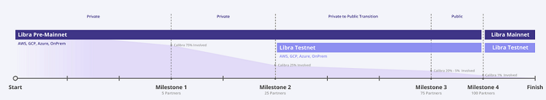

A collection about all things Libra, Move & ZuckerBucks - Let's reinvent money with fast and cheap world-wide transfers; let's bank the 1.7 billion unbanked, ...

# Awesome Libra (and Move)

_Moving money around the world should be as easy and cheap as sending a text message (or a photo)._


## Books


{: style="float: left"}
[**Libra Shrugged: How Facebook Tried to Take Over the Money**](https://davidgerard.co.uk/blockchain/libra/) 
by David Gerard, November 2020, 182 Pages --
_Introduction: Taking over the money  ++
A user's guide to Libra   ++
The genesis of Libra: Beller's blockchain ++
To launch a Libra: Let’s start a crypto  ++
Bitcoin: why Libra is like this  ++
The Libra White Papers  ++
Banking the unbanked  ++
The Libra Reserve plan and economic stability ++
Libra, privacy and your digital identity  ++
The regulators recoil in horror  ++
David Marcus before the US House and Senate ++
July to September 2019: Libra runs the gauntlet  ++
October 2019: Libra's bad month  ++
Mark Zuckerberg before the US House  ++
November 2019: The comedown  ++
Central bank digital currencies  ++
Epilogue: Libra 2.0: not dead yet  ++
Appendix: 2010–2013: The rise and fall of Facebook Credits_


## Libra

web: [`libra.org`](https://libra.org)

- [The Official Libra White Paper](https://libra.org/en-US/white-paper), [PDF Download (~600k, 12 Pages)](https://github.com/openblockchains/blockchain-whitepapers/raw/master/libra.pdf) 

> Libra's mission is to enable a simple global currency and financial infrastructure that empowers billions of people.
>
> This document outlines our plans for a new decentralized blockchain, a low-volatility cryptocurrency, 
> and a contract platform that together aim to create a new opportunity for responsible financial services innovation.


## Currency / Money

> Libra's goal: A stable cryptocurrency built on a secure and stable open-source blockchain, 
> backed by a reserve of real assets, and governed by an independent association.
>
> (Source: Libra White Paper)


Libra is a stable coin backed by a basket of (four?) currencies (USD, EURO, GBP, JPY), 
and US Treasury securities in an attempt to avoid volatility (and speculation). 
Facebook has announced that each of the (100?) partners will stake an initial US$10 million, so Libra is backed by US$1 billion of solid currency, on the day it opens.

(Source: [Libra (cryptocurrency) @ Wikipedia](https://en.wikipedia.org/wiki/Libra_(cryptocurrency)))


Q: What's a Microlibra? What's the smallest Libra subunit? 

A: Libra can be broken into 1 million smaller units, that is, 0.000001 Libra (six digits).
The official name for the smallest 0.000001 Libra unit is Microlibra. 


**Libra Rerseve**

- The Official Libra Reserve White Paper, [PDF Download (~40k, 4 Pages)](https://github.com/openblockchains/blockchain-whitepapers/raw/master/libra-reserve.pdf)

> Q: What are the actual assets that will be backing each Libra coin? A: The actual assets will be
> a collection of low-volatility assets, including bank deposits and government securities in currencies
> from stable and reputable central banks. As the value of Libra will be effectively linked to a basket
of fiat currencies, from the point of view of any specific currency, there will be fluctuations in the
value of Libra. The makeup of the reserve is designed to mitigate the likelihood and severity of these
fluctuations, particularly in the negative direction (i.e., even in economic crises). To that end, the
above basket has been structured with capital preservation and liquidity in mind. On the capital
preservation point, the association will only invest in debt from stable governments with low default
probability that are unlikely to experience high inflation. In addition, the reserve has been diversified
by selecting multiple governments, rather than just one, to further reduce the potential impact of such
events. In terms of liquidity, the association plans to rely on short-dated securities issued by these
governments, that are all traded in liquid markets that regularly accommodate daily trading volume
in the tens or even hundreds of billions. This allows the size of the reserve to be easily adjusted as
the number of Libra in circulation expands or contracts.


**Mint & Burn Libras**

> The Libra Association is the only party able to create
> (mint) and destroy (burn) Libra. Coins are only minted when authorized resellers have purchased those coins
> from the association with real assets to fully back the new coins. 
> Coins are only burned when the authorized
> resellers sell Libra coin to the association in exchange for the underlying assets. 
> Since authorized resellers will always be able to sell Libra coins to the reserve at a price equal to the value of the basket, 
> the Libra Reserve acts as a "buyer of last resort." 
>
> (Source: Libra White Paper)


## Digital Identity (Id)

_Open Identity (Id) Standard_

> An additional goal of the Libra association is to develop and promote an open identity standard.
> We believe that decentralized and portable digital identity is a prerequisite to financial inclusion and competition.
>
> (Source: Libra White Paper)


## Org

Libra Association, Switzerland, Quai de l'Ile 13, Gèneve 1204.

> The Libra Association is an independent, not-for-profit membership organization, headquartered in Geneva, Switzerland.


## Code

github: [`libra`](https://github.com/libra)

- Libra Core (Testnet Client), github: [`libra/libra`](https://github.com/libra/libra)

### Blockchain / Protocol

- [The Official Libra Blockchain / Protocol White Paper](https://developers.libra.org/docs/the-libra-blockchain-paper), [PDF Download (~400k, 29 Pages)](https://github.com/openblockchains/blockchain-whitepapers/raw/master/libra-blockchain.pdf) 

> **Abstract**: The Libra Blockchain is a decentralized, programmable database designed to support a
> low-volatility cryptocurrency that will have the ability to serve as an efficient medium of exchange for
> billions of people around the world. We present a proposal for the Libra protocol, which implements
> the Libra Blockchain and aims to create a financial infrastructure that can foster innovation, lower
> barriers to entry, and improve access to financial services. To validate the design of the Libra protocol,
> we have built an open-source prototype implementation - Libra Core - in anticipation of a global
> collaborative effort to advance this new ecosystem.
>
> The Libra protocol allows a set of replicas - referred to as validators - from different authorities
> to jointly maintain a database of programmable resources. These resources are owned by different
> user accounts authenticated by public key cryptography and adhere to custom rules specified by the
> developers of these resources. Validators process transactions and interact with each other to reach
> consensus on the state of the database. Transactions are based on predefined and, in future versions,
> user-defined contracts in a new programming language called Move.
>
> We use Move to define the core mechanisms of the blockchain, such as the currency and validator
> membership. These core mechanisms enable the creation of a unique governance mechanism that
> builds on the stability and reputation of existing institutions in the early days but transitions to a
> fully open system over time.

**Are We Decentralized Yet?**

- The Official Libra Roadmap White Paper from Members-Only (Permissioned) to Public (Permissionless) Blockchain, [PDF Download (~50k, 5 Pages)](https://github.com/openblockchains/blockchain-whitepapers/raw/master/libra-governance.pdf)

> We believe that for the Libra network to achieve its full potential, it needs to be permissionless.
> As a result, one of the association's directives will be to work with the community to research and implement
> this transition, which will begin within five years of the public launch of the Libra Blockchain and ecosystem.


### Move Programming Language

_The (Secure) Contract-Oriented Programming Language for Digital (Blockchain) Resources / Assets_

- [The Official Move: A Language With Programmable Resources White Paper](https://developers.libra.org/docs/move-paper), [PDF Download (~200k, 26 Pages)](https://github.com/openblockchains/blockchain-whitepapers/raw/master/libra-move.pdf) 

> **Abstract:** We present Move, a safe and flexible programming language for the Libra Blockchain.
> Move is an executable bytecode language used to implement custom transactions and contracts.
> The key feature of Move is the ability to define custom resource types with semantics inspired by linear
> logic: a resource can never be copied or implicitly discarded, only moved between program storage
> locations. These safety guarantees are enforced statically by Move's type system. Despite these
> special protections, resources are ordinary program values - they can be stored in data structures,
> passed as arguments to procedures, and so on. First-class resources are a very general concept that
> programmers can use not only to implement safe digital assets but also to write correct business
> logic for wrapping assets and enforcing access control policies. The safety and expressivity of Move
> have enabled us to implement significant parts of the Libra protocol in Move, including Libra coin,
> transaction processing, and validator management.


Planned to be a statically-typed programming language derived from Rust, compiled to bytecode.

[`p2p_payment.mvir`](contracts/snippets/p2p_payment.mvir) - Example of a peer-to-peer transaction script:

```
// Simple peer-peer payment example.

// Use LibraAccount module published on the blockchain at account address
// 0x0...0 (with 64 zeroes). 0x0 is shorthand that the intermediate representation (IR) pads out to
// 256 bits (64 digits) by adding leading zeroes.
import 0x0.LibraAccount;
import 0x0.LibraCoin;
main(payee: address, amount: u64) {
  // The bytecode (and consequently, the intermediate representation (IR)) has typed locals.  The scope of
  // each local is the entire procedure. All local variable declarations must
  // be at the beginning of the procedure. Declaration and initialization of
  // variables are separate operations, but the bytecode verifier will prevent
  // any attempt to use an uninitialized variable.
  let coin: R#LibraCoin.T;
  // The R# part of the type above is one of two *kind annotation* R# and V#
  // (shorthand for "Resource" and "unrestricted Value"). These annotations
  // must match the kind of the type declaration (e.g., does the LibraCoin
  // module declare `resource T` or `struct T`?).

  // Acquire a LibraCoin.T resource with value `amount` from the sender's
  // account.  This will fail if the sender's balance is less than `amount`.
  coin = LibraAccount.withdraw_from_sender(move(amount));
  // Move the LibraCoin.T resource into the account of `payee`. If there is no
  // account at the address `payee`, this step will fail
  LibraAccount.deposit(move(payee), move(coin));

  // Every procedure must end in a `return`. The IR compiler is very literal:
  // it directly translates the source it is given. It will not do fancy
  // things like inserting missing `return`s.
  return;
}
```

More contract samples (from the [Move Contract Playground](https://libraide.com/)):

[`mint.mvir`](contracts/snippets/mint.mvir):

```
import 0x0.LibraAccount;
import 0x0.LibraCoin;
main(payee: address, amount: u64) {
  LibraAccount.mint_to_address(move(payee), move(amount));
  return;
}
```

[`transfer.mvir`](contracts/snippets/transfer.mvir):

```
import 0x0.LibraAccount;
main (payee: address, amount: u64) {
  LibraAccount.pay_from_sender(move(payee), move(amount));
  return;
}
```

[`balance.mvir`](contracts/snippets/balance.mvir):

```
import 0x0.LibraAccount;

main() {
    let addr: address;
    let struct1_original_balance: u64;
    addr = get_txn_sender();
    struct1_original_balance = LibraAccount.balance(copy(addr));
    assert(copy(struct1_original_balance) > 10, 77);

    return;
}
```

[`address.mvir`](contracts/snippets/address.mvir):

```
main() {
    let a1: address;
    let a2: address;
    let a3: address;
    let a4: address;
    let a5: address;
    let a6: address;
    let a7: address;
    let a8: address;
    let a9: address;

    a1 = 0x1;
    a2 = 0x01;
    a3 = 0x0001;
    a4 = 0x00000001;
    a5 = 0x0000000000000001;
    a6 = 0x00000000000000000000000000000001;
    a7 = 0x000000000000000000000000000000001;
    a8 = 0x000000000000000000000000000000000000000000000000000000000000001;
    a9 = 0x0000000000000000000000000000000000000000000000000000000000000001;

    assert(copy(a1) == copy(a2), 42);
    assert(copy(a2) == copy(a3), 43);
    assert(copy(a3) == copy(a4), 44);
    assert(copy(a4) == copy(a5), 45);
    assert(copy(a5) == copy(a6), 46);
    assert(copy(a6) == copy(a7), 47);
    assert(copy(a7) == copy(a8), 48);
    assert(copy(a8) == copy(a9), 49);
    return;
}
```

[`create_account.mvir`](contracts/snippets/create_account.mvir):

```
import 0x0.LibraAccount;
import 0x0.LibraCoin;

main() {
    let addr: address;
    let account_exists: bool;
    let ten_coins: R#LibraCoin.T;
    let account_exists_now: bool;

    addr = 0x0111111111111111111111111111111111111011111111111111111111111110;
    account_exists = LibraAccount.exists(copy(addr));
    assert(!move(account_exists), 83);

    ten_coins = LibraAccount.withdraw_from_sender(10);
    create_account(copy(addr));
    LibraAccount.deposit(copy(addr), move(ten_coins));

    account_exists_now = LibraAccount.exists(copy(addr));
    assert(move(account_exists_now), 84);

    return;
}
```


## Consensus with Byzantine Fault Tolerance (BFT)

_Inside Libra Byzantine Fault Tolerance (BFT) and the HotStuff Protocol - The Truth Machine with State Replication_ 


- [The Official Libra Byzantine Fault Tolerance (BFT): State Machine Replication in the Blockchain White Paper](https://developers.libra.org/docs/state-machine-replication-paper), [PDF Download (~300k, 41 Pages)](https://github.com/openblockchains/blockchain-whitepapers/raw/master/libra-consensus.pdf) 

> **Abstract**: This report presents LibraBFT, a robust and efficient state machine replication system designed for the Libra Blockchain.
> LibraBFT is based on HotStuff, a recent protocol that leverages several decades of scientific advances in Byzantine fault tolerance (BFT)
> and achieves the strong scalability and security properties required by internet settings. LibraBFT further refines the HotStuff
> protocol to introduce explicit liveness mechanisms and provides a concrete latency analysis. To drive the integration with the Libra
> Blockchain, this document provides specifications extracted from a fully-functional simulator. These specifications include state
> replication interfaces and a communication framework for data transfer and state synchronization among participants. 
> Finally, this report provides a formal safety proof that induces criteria to detect misbehavior of BFT nodes, 
> coupled with a simple reward and punishment mechanism.


- [What is HotStuff and why is it a big deal](https://medium.com/@cypherium/what-is-hotstuff-and-why-is-it-a-big-deal-213f39696763) by Cypherium, June 18, 2019
- [What is the difference between Practical Byzantine Fault Tolerance (PBFT), Tendermint, Scalable Byzantine Fault Tolerance (SBFT) and HotStuff?](https://ittaiab.github.io/2019-06-23-what-is-the-difference-between/) by Ittai Abraham, June 23, 2019
- [Facebook's proposed currency is technically sound, but should you trust it?](https://medium.com/dapperlabs/dapper-labs-cto-reviews-libra-s-white-paper-656638778100) by Dapper Labs, June 21, 2019
- [On LibraBFT's use of broadcasts](https://blog.trailofbits.com/2019/07/12/librabft/) by Sam Moelius (Trail of Bits), July 12, 2019 


**HotStuff**

- [HotStuff: Three-chain Rules!](https://dahliamalkhi.wordpress.com/2018/10/24/hotstuff-three-chain-rules/) by Dahlia Malkhi, October 24, 2018 - Most protocols contain quadratic voting steps. When Byzantine consensus protocols were originally conceived, a typical target system size was n=4 or n=7, tolerating one or two faults. But scaling Byzantine Fault Tolerance (BFT) consensus to n=2000 means that even on a good day, when communication is timely and a handful of failures occurs, quadratic steps require 4,000,000 messages. A cascade of failures might bring the communication complexity to whopping 8,000,000,000 (!) transmissions for a single consensus decision...
- [HotStuff: Byzantine Fault Tolerance (BFT) Consensus with Linearity and Responsiveness Whitepaper](https://arxiv.org/abs/1803.05069),  [PDF Download (~800k, 10 Pages)](https://github.com/openblockchains/blockchain-whitepapers/raw/master/hotstuff.pdf) by Maofan Yin, Dahlia Malkhi, Michael K. Reiter, Guy Golan Gueta, Ittai Abraham -  a leader-based Byzantine fault-tolerant replication protocol for the partially synchronous model. Once network communication becomes synchronous, HotStuff enables a correct leader to drive the protocol to consensus at the pace of actual (vs. maximum) network delay - a property called responsiveness - and with communication complexity that is linear in the number of replicas. To our knowledge, HotStuff is the first partially synchronous BFT replication protocol exhibiting these combined properties. Its simplicity enables it to be further pipelined and simplified into a practical, concise protocol for building large-scale replication services.


## Community

- Libra Discussion Forum [`community.libra.org`](https://community.libra.org)
- Libra Dev / Tech Updates [`@libradev`](https://twitter.com/libradev)
- Libra Dev / Tech Blog [`developers.libra.org/blog`](https://developers.libra.org/blog/)


## Testnet

### Blockchain Explorer

_Transactions, Transactions, Transactions_

- [Libra Testnet Explorer](https://librabrowser.io), [(Source)](https://github.com/Disk1n/LibraBrowser) by [Gal Diskin](https://twitter.com/gal_diskin)   - incl. faucet to mint your own free (test) libra tokens / money
- [Libra Block (Testnet Explorer)](https://librablock.io), [(Source Front-End)](https://github.com/libra-china-org/librablock-frontend), [(Source Back-End)](https://github.com/libra-china-org/librabock-backend)
- [Libra Vista (Testnet Explorer)](https://www.libravista.com)
- [Libranaut (Testnet Explorer)](https://libranaut.io)
- [Libratics (Testnet Explorer)](http://libratics.com)
- [iLibraExplorer](https://ilibraexplorer.com)

### Wallets 

Official

**Calibra** (web: [`calibra.com`](https://calibra.com)) - Facebook's official wallet for Libra. Calibra will be available in the Apple App Store, Google Play Store, integrated into Facebook's Messenger and WhatsApp. Calibra's launch is planned for the 2nd half of 2020. Calibra will be a custodial wallet - meaning they hold the actual Libra tokens - for the user (that's you!) - 
and will require KYC (Know Your Customer).


Articles & Live Demos

- [The First Libra Wallet Proof-of-Concept (POC) - Building your own Wallet and APIs](https://medium.com/kulapofficial/the-first-libra-wallet-poc-building-your-own-wallet-and-apis-3cb578c0bd52)
by Nattapon Nimakul, June 23, 2019
  - [Live Demo](https://dev.kulap.io/libra/), [(Source)](https://github.com/kulapio/libra-wallet-poc)
- [Libra Paper Wallet](https://librapaperwallet.com) ([Source](https://github.com/librastartup/libra-paper-wallet)) by Libra Startup; generate a new Libra cryptocurrency wallet address, its QR code, and the recovery seed - 24 words


### Libraries


**JavaScript**

- [Libra Core](https://github.com/perfectmak/libra-core) by Perfect Makanju  - a javascript library client that can be used to interact with libra nodes. Coded in typescript
- [Libra gRPC](https://github.com/bonustrack/libra-grpc) by Fabien - a lightweight JavaScript library for Libra
- [Libra API](https://github.com/bonustrack/libra-api) by Fabien  - a REST API for Libra blockchain
- [Libra Web](https://github.com/bandprotocol/libra-web) by Paul C. (Band Protocol) -  a javascript client for Libra blockchain. The library allows javascript program to interact with Libra nodes with protobuf message through grpc web. It works in both browser and node.js environments

**Python**

- [PyLibra](https://github.com/bandprotocol/pylibra) by Sorawit Suriyakarn (Band Protocol) - a python client for Libra blockchain. The library allows Python program to interact with Libra nodes with protobuf message through grpc 
- [Libra gRPC](https://github.com/egorsmkv/libra-grpc-py) by Yehor Smoliakov - a gRPC client for Libra in Python

**Ruby**

- [Libra Client](https://github.com/yuan-xy/libra_client_ruby) by Yuan - a client library that lets you interact with Libra nodes with protobuf message through gRPC

**Go**

- [Libra Go Client](https://github.com/codemaveric/libra-go) by Ibraheem Bello - a go client for interacting with Libra blockchain
- [Libra Go SDK](https://github.com/philippgille/libra-sdk-go) by Philipp Gillé - a go dev kit for Libra
- [Libra Example](https://github.com/phlip9/libra_example) by Philip Kannegaard Hayes - example Libra Go client 
- [go-libra](https://github.com/the729/go-libra) by the729 - a Libra go client library with crypto verifications

**Java Libraries**

- [Libraj](https://github.com/libra-vista/libraj) by Wen Shen Jun  - a java library client that can be used to interact with libra nodes
- [Jlibra](https://github.com/ketola/jlibra) by Sauli Ketola  - a Java library for interacting with the Libra blockchain.


### Courses / Code Schools

[**CryptoZombies (Libra/Move Edition)**](https://cryptozombies.io/libra/)  Upcoming! -
learn Libra blockchain contract programming by coding your own  game using the Move programming language; completely free and open source
- [**Libra Basics Lesson 1 Live - Becoming a Shop Owner**](https://cryptozombies.io/en/lesson/12/chapter/1)  -- In this first lesson, you'll learn how to interact with the Libra testnet blockchain using the command line interface (CLI). This perfectly simulates how you can interact with the REAL libra testnet today. Later, we'll show you how to install it yourself.

[**MoveCastle**](https://learnlibramove.com) - learn Libra blockchain contract programming 
by coding your own game using the Move programming language;
by Blockchain Lab of Beijing Normal University and White Matrix Corporation


### More

- [#libra](https://github.com/topics/libra) Topic @ GitHub


<!-- break -->

- [Help & Discussion in Testnet Channel / Category](https://community.libra.org/c/testnet) @ Libra Discussion Forum
- [Connecting to Libra TestNet on Windows with the Windows Subsystem for Linux (WSL)](https://medium.com/coinmonks/connecting-to-libra-testnet-on-windows-with-wsl-45bdfd23150a) by Ibraheem Kolawole Bello, June 19th, 2019


## Forks & Alternatives

### Open Libra

_An open platform for financial inclusion. Not run by Facebook._

web: [`openlibra.io`](https://www.openlibra.io),
github: [`open-libra`](https://github.com/open-libra)

build on Libra's strengths but extend it where needed. OpenLibra aims to be technically (Move Language) and financially compatible (Libra coin), embracing what is powerful, but also replacing what's concerning in a non-adversarial way. 


## Timeline

- June 18th, 2019 - Libra Testnet Live and Open Source Libra Client (Core) Code

<!-- break -->



What's upcoming? See the [Libra Core Roadmap](https://github.com/orgs/libra/projects/1)


## Reference

- [Libra (cryptocurrency) @ Wikipedia](https://en.wikipedia.org/wiki/Libra_(cryptocurrency))
  - [Libra (cryptocurrency) Talk / Discussion @ Wikipedia](https://en.wikipedia.org/wiki/Talk:Libra_(cryptocurrency))


## Trivia & Fun Facts

Q: Why is it called Libra? A: The Libra name was inspired by 
(1) Libra the [Roman unit of weight measure](https://en.wikipedia.org/wiki/Ancient_Roman_units_of_measurement), which was eventually used to mint coins. 
(2) Libra the astrological symbol is the balance of justice, and
(3) Libra phonetically sounds like libre, which is French for free or freedom.
The Libra name is a combination of money, justice, and freedom.


Did you know? David Marcus is the public face of Facebook's Libra - but Morgan Beller started the cryptocurrency effort in 2017, 
before Marcus was even at Facebook. (Source: [Meet Morgan Beller, the 26-year-old woman behind Facebook's plan to make its own currency](https://www.cnbc.com/2019/07/20/facebook-libra-partly-created-by-female-engineer-morgan-beller.html), by Salvador Rodriguez (CNBC), July 20, 2019) 


## Articles

Official

- [Five months and growing strong: the Libra project](https://developers.libra.org/blog/2019/11/15/5-months-and-growing-strong) by Michael Engle (Libra Association), Nov 15, 2019
- [Why building a new protocol for money is the only way to truly change the game for people](https://medium.com/@davidmarcus/why-building-a-new-protocol-for-money-is-the-only-way-to-truly-change-the-game-for-people-254c55407e22) by David Marcus (Libra / Calibra Project Chief / Head), July 25, 2019 
- [Libra Testimony @ US Senate, Committee on Banking, PDF Download (~100k, 7 Pages)](https://www.banking.senate.gov/imo/media/doc/Marcus%20Testimony%207-16-19.pdf) by David Marcus (Libra / Calibra Project Chief / Head), July 16, 2019
- [Libra, 2 weeks in](https://www.facebook.com/notes/david-marcus/libra-2-weeks-in/10158616513819148/) by David Marcus (Libra / Calibra Project Chief / Head), July 3, 2019
- [Libra: The Path Forward](https://developers.libra.org/blog/2019/06/18/the-path-forward) by Libra Engineering Team, June 18, 2019 - Today we are announcing the Libra testnet, a live demonstration of an early prototype of the technology behind Libra - a simple global currency and financial infrastructure that can empower billions of people...
- [Coming in 2020: Calibra - A New Digital Wallet for a New Digital Currency](https://newsroom.fb.com/news/2019/06/coming-in-2020-calibra/) by Facebook Newsroom, June 18, 2019

Pro

- [(Christian Catalini) Libra co-creator (and Calibra Head Economist) explains, defends Facebook's cryptocurrency](https://mitsloan.mit.edu/ideas-made-to-matter/libra-co-creator-explains-defends-facebooks-cryptocurrency) by Beth Stackpole, MIT Sloan Business School Newsletter, Nov 13, 2019


Neutral

- [First Look: Libra](https://info.binance.com/en/research/marketresearch/libra.html) by Binance Research, June 18th 2019 - An in-depth review of Facebook's long-anticipated entry into cryptocurrency
- [Libra: Understanding Facebook's Digital Currency](https://pages.consensys.net/understanding-libra)
by Coogan Brennan (ConsenSys), Sept 2019 - 21-page guide booklet (free PDF download; email registration required)


Regulation, Regulation, Regulation

There's a [bipartisan bill in US Congress](https://sylviagarcia.house.gov/media/press-releases/rep-sylvia-garcia-and-rep-lance-gooden-introduce-managed-stablecoins-are) to firmly rule that managed stablecoins - they mean Libra - are securities. 
Sylvia Garcia (D-TX) and Lance Gooden (R-TX) are pretty sure that Libra-like tokens would be securities already - it was 
immediately obvious that this would constitute an exchange-traded fund or synthetic foreign-exchange derivative - but 
they want to nail it down. Whether this bill has legs depends ...
(via [David Gerard, Nov 22, 2019 - News: Libra and stablecoins and [the US Treasury's Financial Crimes Enforcement Network] (FinCEN)](https://davidgerard.co.uk/blockchain/2019/11/22/news-libra-and-stablecoins-and-fincen-china-still-hates-crypto-trading-tether/))

- [Uncle Sam weighs Libra](https://decrypt.co/7910/uncle-sam-weighs-libra) by Ben Munster (Decrypt), July 16, 2019 - Facebook's David Marcus spoke before [the US] Congress on the company's upcoming pseudo-bank, Libra. The oldies on Capitol Hill [in Washington] could barely conceal their contempt...
- [[US] Fed[eral] [Reserve] chief [Jerome Powell] calls for Facebook to halt Libra project until concerns addressed](https://www.reuters.com/article/us-usa-fed-powell-libra/fed-chief-calls-for-facebook-to-halt-libra-project-until-concerns-addressed-idUSKCN1U51VE), July 10, 2019, Reuters


Scams, Scams, Scams - The Art of the Steal

- [Facebook's Libra currency spawns a wave of fakes, including on Facebook itself](https://www.washingtonpost.com/technology/2019/07/22/facebooks-libra-currency-spawns-wave-fakes-including-facebook-itself) by Drew Harwell, Tony Romm and Cat Zakrzewski (Washington Post), July 22, 2019 - Roughly a dozen fake accounts, pages and groups scattered across Facebook and its photo-sharing app Instagram present themselves as official hubs for the digital currency, in some cases offering to sell Libra at a discount if viewers visit potentially fraudulent, third-party websites... 


Skeptic / Critical Thinking

- [Facebook Libra is Architecturally Unsound](http://www.stephendiehl.com/posts/libra.html) by Stephen Diehl, November 2019 - Libra's byzantine tolerance on a permissioned network is an incoherent design; Libra has no transaction privacy; Libra HotStuff BFT is not capable of achieving the throughput necessary for a payment rail; Libra's Move language is not sound; Libra's cryptography engineering is unsound; Libra has no capacity for consumer protection mechanisms. Answer: [Factual inaccuracies of "Facebook Libra is Architecturally Unsound"](https://tonyarcieri.com/factual-inaccuracies-of-facebook-libra-is-architecturally-unsound) by Tony Arcieri  

- [Thoughts on Facebook's Libra Coin](https://prestonbyrne.com/2019/07/17/libra/) by Preston Byrne, July 17, 2019 - Permissioned blockchains: where it all began...  

- [Why Facebook's Libra currency gets the thumbs down](https://www.theguardian.com/business/2019/jul/02/why-facebook-libra-currency-gets-the-thumbs-down) by Joseph Stiglitz, July 2, 2019 - Facebook has earned a level of distrust that took the banking sector much longer to achieve. Time and again, Facebook's leaders, faced with a choice between money and honouring their promises, 
have grabbed the money. And nothing could be more about money than creating a new currency. 
Only a fool would trust Facebook with his or her financial wellbeing. 
But maybe that's the point: with so much personal data on some 2.4bn monthly active users, 
who knows better than Facebook just how many suckers are born every minute?

- [The Real Threat From Facebook's Libra Coin](https://www.forbes.com/sites/francescoppola/2019/06/30/the-real-threat-from-facebooks-libra-coin/) by Frances Coppola, June 30, 2019 - Facebook's Libra cryptocurrency is generating an immense amount of hype. 
Some hail it as the beginning of the end of sovereign currencies. 
Others believe it will draw people into the cryptocurrency world, 
leading them inexorably to place their faith in the One True Cryptocurrency, Bitcoin...

- [Facebook's New Currency Has Big Claims and Bad Ideas - Libra is an ideological project, not a practical one](https://foreignpolicy.com/2019/06/24/971554-facebook-bitcoin-libra-crypto-bad/) by David Gerard (Foreign Policy), June 24, 2019 - Libra has certainly demonstrated one of the main characteristics of blockchain projects - grandiose claims and egregious nonsense...

- [Facebook's Libra Must Be Stopped](https://www.project-syndicate.org/commentary/facebook-libra-must-be-stopped-by-katharina-pistor-2019-06) by Katharian Pistor (Project Syndicate), June 20, 2019 - Facebook has now unveiled a cryptocurrency and payment system that could take down the entire global economy. Governments must intervene before a company that "moves fast and breaks things" ends up breaking everything...

- [Facebook's Cryptocurrency: Stop It Before It Starts](https://www.lawfareblog.com/facebooks-cryptocurrency-stop-it-it-starts) by Nicholas Weaver, June 19, 2019 - The [Libra] coin is really a Facebook project. It is not live yet, giving governments the opportunity to kill this project before it gets off the ground and gives rise to cybercriminals who couldn't capitalize on existing cryptocurrencies. In particular, the [Internal Revenue Service] IRS and [the U.S. Treasury's Financial Crimes and Enforcement Network] FinCEN should take action now...

- [FacebookCoin is being announced on Tuesday - and we still don't know why it's a crypto](https://davidgerard.co.uk/blockchain/2019/06/15/facebookcoin-is-being-announced-on-tuesday-and-we-still-dont-know-why-its-a-crypto/) by David Gerard, June 15, 2019 - FacebookCoin is being announced on Tuesday! It's called Libra, and Facebook are apparently stressing very hard that everyone should call it Libra, and not Facebook-anything. And definitely not ZuckerBucks...


## Awesome Awesomeness

_A curated list of awesome lists_

- [Awesome Libra Blockchain](https://github.com/copperbits/awesome-libra) by Copperbits 
- [Awesome Libra](https://github.com/learndapp/awesome-libra) by LearnDapp 
- [Awesome Libra](https://github.com/methuz/Awesome-Libra) by Methuz Kaewsaikao 
- [#awesome-libra](https://github.com/topics/awesome-libra) Topic @ GitHub

More curated lists or dashboards

- [Librazilla](https://librazilla.com) - Libra cryptocurrency resources dashboard; tools, tutorials, docs, links and other useful things for the Libra blockchain
 


## Meta

**License**


The list is dedicated to the public domain. Use it as you please with no restrictions whatsoever.

